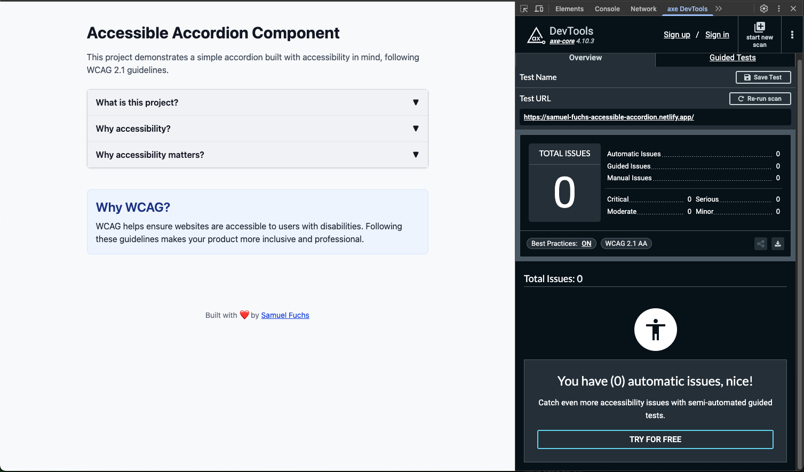
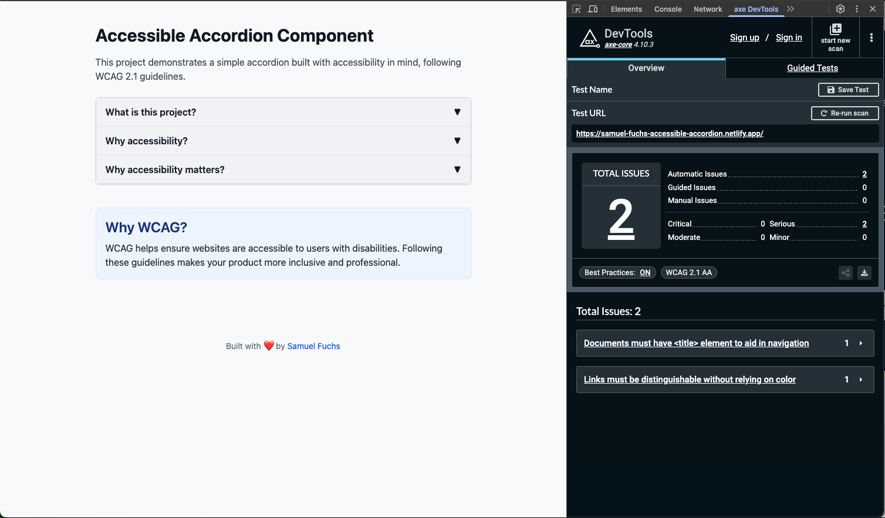
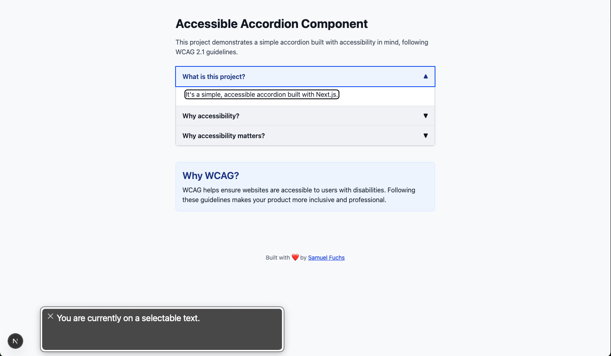
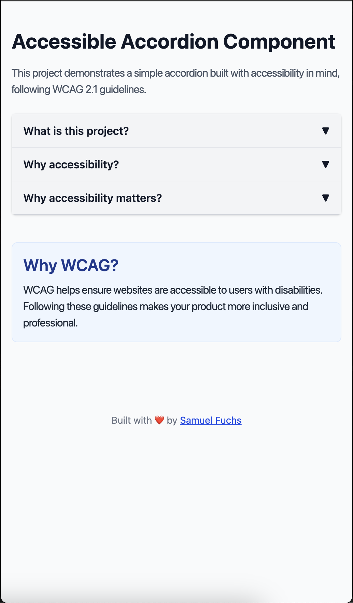
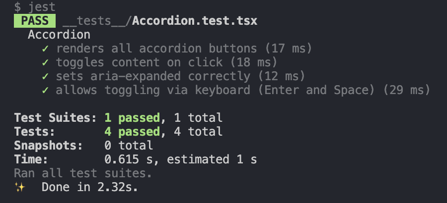

# Simple Accessible Accordion

I built this project to showcase how to create accessible UI components — and how to **test**, **validate**, and ensure they behave the way users (and screen readers) expect.

It’s a simple accordion built with **Next.js**, **React**, and **Tailwind CSS**, but designed with accessibility at its core. From ARIA attributes to keyboard navigation and screen reader support, this component reflects my commitment to building inclusive web experiences.

## Notes

I could have created separate branches for each feature and fix, but kept everything in main for simplicity in this case.

## Live Demo

Try it here: [samuel-fuchs-accessible-accordion.netlify.app](https://samuel-fuchs-accessible-accordion.netlify.app/)

## Features

- WCAG 2.1 A/AA–compliant styling and markup
- Keyboard-accessible (Tab, Enter, Space)
- ARIA attributes: `aria-expanded`, `aria-controls`, `aria-labelledby`, `role="region"`
- Icon rotation for visual cue
- Responsive layout
- Axe-tested: 0 violations
- Jest-tested for accessibility behaviors


## Accessibility Testing

### Axe DevTools
- Used the browser extension to validate color contrast, ARIA usage, and interactions
- Fixed all initial issues:
- Missing <title> → Fixed via Next.js metadata
- Link color contrast → Adjusted and underlined

### VoiceOver (macOS)
- Button labels are read correctly
- `aria-expanded` state is announced
- Toggled content is properly accessible

### Keyboard Navigation
- Tabbing focuses each button
- Space / Enter toggle open/close state
- Visual focus rings are present

## Testing

Tested with `Jest` and `React Testing Library` using `@testing-library/user-event` for realistic interactions.

### What’s covered:

- Renders all accordion items
- Toggles content on click and with keyboard
- `aria-expanded` updates correctly
- Keyboard focus and toggling via Enter/Space

### Run tests:

```
npm run test
```

## Build Steps I took
1. Project Configuration

- Initialized project with Next.js, Tailwind, TypeScript

2. Accordion Component

- Built fully accessible component with props

3. ARIA & WCAG Support

- Level A/AA:
- `aria-expanded`, `aria-controls`, `aria-labelledby`
- `role="region"` for content
- Focus styles using `focus:outline`

4. Main Page Layout

- Used semantic headings (example: h1, h2)
- Sectioned content

5. Accessibility Passes

- Axe: initial scan flagged 2 issues → resolved
- VoiceOver manually tested

## Screenshots

### Axe Audit – 0 Issues


### Axe Audit – first scan


### VoiceOver Reading Accordion


### Mobile Responsive View


### Jest Tests Passing


## Author

Made with ❤️ by [Samuel Fuchs](https://github.com/samuelfuchs)

I care deeply about building inclusive, user-first digital experiences — and I’m always learning more about how accessibility can drive better UX and broader reach.